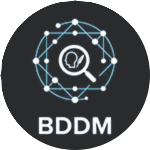

<table>
  <tr>
    <td width="200" align="center" valign="middle">
      
    </td>
    <td valign="middle">
      <h1>A Python Module for Bibliographic Data Disambiguation & Scholarly Data Integration</h1>
    </td>
  </tr>
</table>

---

## 📌 About

**bddm-core-ml** is a robust Python module designed to tackle one of the toughest challenges in academic data processing: **bibliographic data disambiguation**.

In scholarly data pipelines, authors, references, and publications come from heterogeneous sources with inconsistent formatting. This library provides tools to:

- ✨ Resolve author identity ambiguity  
- 🔗 Normalize publication and reference entries  
- 🧠 Support research pipelines with clean, deduplicated metadata

🔍 Built for researchers, data engineers, and ML practitioners who work with scholarly datasets and need scalable, reliable entity resolution.

---

## 🚀 Features

✔ Disambiguate authors across multiple citation sources  
✔ Normalize and match publication identities  
✔ Easy integration with machine learning workflows  
✔ Lightweight and pure-Python  
✔ MIT licensed  

---

## 🧰 Installation

```bash
git clone https://github.com/yigitarsland/bddm-core-ml.git
cd bddm-core-ml
pip install -r requirements.txt
```

---

## 🧠 Quick Usage
```bash
from disambiguate_authors import AuthorDisambiguator
from data_utils import load_bibliographic_data

data = load_bibliographic_data("dataset.json")

disambiguator = AuthorDisambiguator()
result = disambiguator.fit_transform(data)

print(result)
```

---

## 🙌 Acknowledgements

Thanks to everyone supporting this project.
If you use this library in research, please consider citing it.